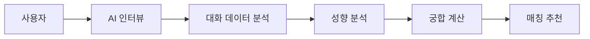

## ✅ 추천 README 구조 (완성본)

# 🧪 SGChem (가제)

> AI 기반 대화 성향 분석 매칭 서비스

---

## 📌 프로젝트 소개

SGChem은 생성형 AI를 활용하여
사용자의 **대화 스타일과 성향을 분석**하고,
이를 기반으로 **궁합이 맞는 상대를 매칭**하는 서비스입니다.

기존 소개팅 서비스가 외형이나 단순 프로필 중심이라면,
SGChem은 **"대화의 케미(Chemistry)"** 를 핵심으로 합니다.

---

## 🎯 기획 의도

* 💬 AI 인터뷰 기반 사용자 분석
* 🧠 대화 스타일 및 성향 추출
* ❤️ 궁합 기반 매칭 추천

> “사람은 대화를 통해 드러난다”
> → 이를 서비스로 구현하는 것이 SGChem의 목표입니다.

---

## 🚨 문제 정의

기존 매칭 서비스의 한계

* 외모 및 프로필 중심 매칭
* 실제 성향 반영 부족
* 첫 대화의 어색함
* 대화 지속률 저하

👉 SGChem은 **대화 기반 분석**으로 이를 해결합니다.

---

## 🧠 핵심 기능

### 1. AI 인터뷰

* AI 페르소나와 자연스러운 대화 진행
* 사용자 특성을 끌어내는 질문 생성

### 2. 대화 성향 분석

* 대화 스타일 (유머형 / 공감형 등)
* 성격 (외향 / 내향)
* 관심사 추출

### 3. 성향 요약

```text
사용자는 대화를 적극적으로 이어가며
유머와 공감을 중심으로 소통하는 경향이 있음
```

### 4. 궁합 분석

```text
궁합 점수: 84점

매칭 이유
- 대화 스타일 유사
- 공통 관심사 존재
```

---

## 🔄 서비스 흐름



---

## 🏗️ 시스템 아키텍처

### Frontend

* React + Vite
* 반응형 웹

### Backend

* Node.js / Python (예정)

### AI

* OpenAI / Claude API

### Database

* 사용자 프로필 & 성향 데이터 저장

---

## 📱 기술 스택

| 영역       | 기술               |
| -------- | ---------------- |
| Frontend | React, Vite      |
| Backend  | Node.js / Python |
| AI       | OpenAI, Claude   |
| DB       | TBD              |

---

## 📊 현재 진행 상황

### ✅ 완료

* 아이디어 기획
* 서비스 구조 정의

### 🔄 진행 중

* 기술 스택 확정
* 프로젝트 계획서 작성

### 🚀 예정

* UI/UX 설계
* 프론트엔드 구현
* AI 기능 연동

---

## 💡 설계 시 고려 사항

* 생성형 AI의 **실질적 서비스 적용**
* 대화 데이터 기반 **성향 분석 로직**
* 사용자 경험 중심 인터페이스

---

## 🌟 기대 효과

* 자연스러운 매칭 경험 제공
* 대화 지속률 향상
* AI 기반 서비스 설계 경험 확보

---

## 🧑‍💻 팀 프로젝트

> 대학원 팀 프로젝트로 진행 중

---

## 📂 프로젝트 구조 (예정)

```bash
src/
 ├── components/
 ├── pages/
 ├── hooks/
 ├── services/
 └── utils/
```

---

## 🚀 실행 방법

```bash
# 설치
npm install

# 실행
npm run dev
```

---

## 📌 향후 계획

* AI 인터뷰 UX 고도화
* 성향 분석 정확도 개선
* 매칭 알고리즘 고도화

---

## 🔗 기타

추후 배포 링크 및 시연 영상 추가 예정
