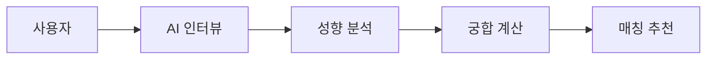

# 🧪 SGChem

> AI 기반 대화 성향 분석 매칭 서비스

---

## 📌 프로젝트 소개

SGChem은 생성형 AI를 활용하여
사용자의 **대화 스타일과 성향을 분석**하고
이를 기반으로 **궁합이 맞는 상대를 매칭**하는 서비스입니다.

기존 소개팅 서비스와 달리
👉 **대화 중심 매칭**을 핵심으로 합니다.

---

## 🎯 핵심 기능

* 💬 AI 인터뷰 기반 사용자 분석
* 🧠 대화 스타일 및 성향 추출
* ❤️ 궁합 기반 매칭 추천

---

## 🔄 서비스 흐름

---

## 🏗️ 기술 스택

* Frontend: React + Vite
* Backend: Python (예정)
* AI: OpenAI / Claude API (예정)
* DB: SQLite (예정)

---

## 📊 진행 상황

* ✅ 기획 완료
* 🔄 프론트엔드 구현 중
* 🚀 AI 기능 연동 예정
